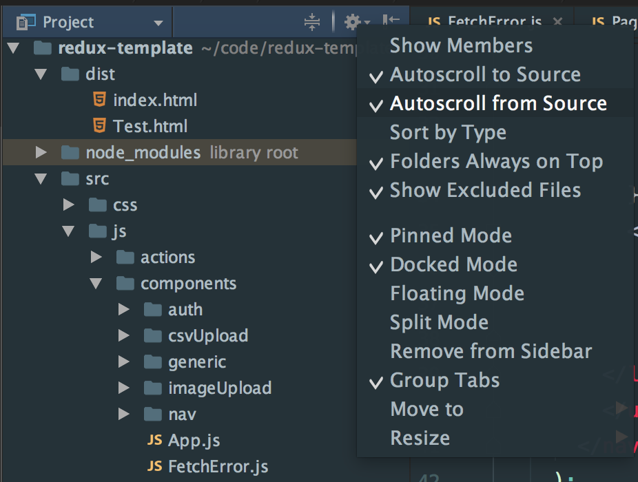

## Some of my Favorites

- open any file `shit + shift`. think of it like `command + t` in sublime
- open/run an action `cmd + shift + a`. i use this to run action like `migration`, `rake` etc.
- access any file or setting by `shift + shift` followed by another `shift + shift`. think of it like `command + p` in sublime
- Reveal file in sidebar - `Option + F1` followed by `Enter`
- auto complete what you are typing.
  - `control + space` will give you options.
  - `tab` will complete it for you and
  - `option + space` will give you the code.
  - `F1` shows documentation.
  - [See in action](http://screencast.com/t/DS1nhmqBM2).
- go to function declaration and browse source code with ease - `Command + Mouse Click`
- Close side bar `Command + 1`
- Toggle Version Control `Command + 9`
- multi line selection `Shift + Alt + Command + Mouse`
- multi word selection `Control + G`
- my trick to bring cursor on multiple adjacent lines without using mouse:
  - select the `\n` of current line
  - then do `control + g` to bring cursor to next line as well.
  - then use arrows to move cursor around or bring them all to the begnining by `command + left arrow` and then move them together.
- selecting text by intelligently growing outwards - `Alt + Up Arrow`
- No need to hit save. Its always auto saving.
- Get a suggestion by doing `Control + Space`. To complete press `Enter` and it will add content or press `Tab` to have it replace whats already there.
- More detail by `Command + F1`
- While I am typing this in `.md` file its showing me a HTML rendered preview on the right
- Setup softwrap in editor and unselect showing of the wrap only on current line.
  [Soft Wrap Options](../assets/webstorm_softwrap_options.png) My preference has been to use softwrap with an extra indent.
- Browse and use Live Templates by - `Command + j`
- To reformat code, `Alt + Command + l`
- To indent code `Contrl + Alt + i`
  https://www.jetbrains.com/help/webstorm/2016.1/changing-indentation.html
- refactor options - `Control + t`
- End of File, Beginning of file `Command + Fn + arrow key`
- Spell Check
- A space for temporary files called `scratches` - `Command + Shift + N` -
  https://www.jetbrains.com/help/phpstorm/10.0/scratches.html
- setup individual test files to run
- Adding type libraries
- quick definition - `alt + space` or `command + y`
- `Command + d` gets you the exact same line underneath it. basically it copies the line without using the clipboard.
- Delete a line by `Command + Delete`. But unlike sublime it wont move cursor to beginning of line.
- collapse and open code folds - `command + +` & `command + -` - very useful as it works everywhere like a charm. by eveywhere i mean also on non paranthesis enclosed things like import statements
- jump to a line number `command + l`
- preview a file by using quick definition `alt + space`
- block commenting, useful when commenting jsx - `command + alt + /`
- check off `add virtual space` in settings to be able to scroll past end of file
- databse view `shift + shift` followed by typing `database`
- switch between project windows back and forth by `Command + BackTick`  and `Command + Shift + BackTick `
- Detect's things you are using like webpack, database, npm, .gitignore etc. and automatically suggest to plugins to make life better
- Run a specific test in spec file by bringing the cursor to where where the test code is and hitting `Control + Shift + r`
- See all test configs in there: `Alt + Command + r`
- Run the last test config again - `Control + r`
- Expland or collapse an item by `Command +(plus) or -(minus)` sign

## References

- [https://egghead.io/lessons/misc-webstorm-installing-custom-color-schemes-dayleress-colour-schemes#/tab-transcript](https://egghead.io/lessons/misc-webstorm-installing-custom-color-schemes-dayleress-colour-schemes#/tab-transcript)
- [Theme Aftherglow](https://github.com/JustSid/AfterglowIntelliJ)
- [Theme Material](https://github.com/ChrisRM/material-theme-jetbrains)
- [Color](https://github.com/boneskull/jetbrains-afterglow-scheme) ~/Library/Preferences/RubyMine2016.2/colors

### Multiple Line Cursor

- Highlight a word and put cursor at all occurrences - `Control + Command + G`
- Highlight a word and put cursor at next occurrence - `Control + G`
- Highlight a word and unselect last occurrence - `Control + Shift + G`
- [More on Multiple Line Cursors](https://blog.jetbrains.com/ruby/2014/03/whats-mining-multiple-cursors-and-selection/)
- Hold the `ALT` key down and then either click on multiple lines or drag your mouse across multiple lines as you are selecting something. 
[Screencast](https://screencast.com/t/JzcId3LSN)

### Side Bar

- Open & close the side bar - `Command + 1`
- Select `Autoscroll from/to source`. This will make current file always be sekected and in view when side
- 

### NPM

- If you have a `package.json` with `scripts` setup, then webstorm will show a nice UI to access them.
- I have assigned the key `Option + n` to open it. Then using the arrows I can select which script i want to run.
